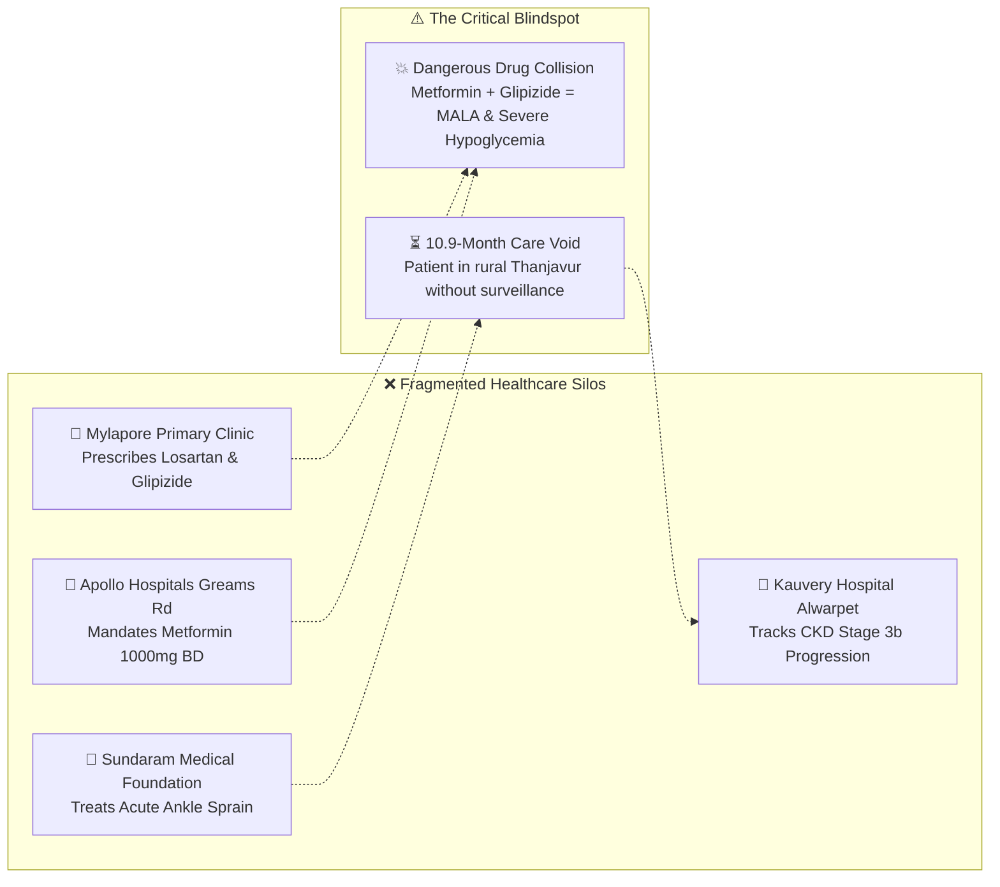

<div align="center">

# ⚡ THRESHOLD // 閾値
### **Cross-Facility Longitudinal Health Synthesis & Deterministic Safety Intelligence**

[](https://nextjs.org/)
[](https://www.typescriptlang.org/)
[](https://tailwindcss.com/)
[](https://lenis.darkroom.engineering/)
[](#-deterministic-reasoning-engine)
[](#)

<br/>

> **"Every hospital gave him another paper slip. None shared his medical history."**  
> *THRESHOLD synthesizes years of scattered, multi-institutional clinical notes, lab reports, and discharge summaries into a unified chronological intelligence timeline—surfacing life-threatening drug conflicts, hidden care gaps, and longitudinal organ decline before it’s too late.*

<br/>

[🌟 Live Demo](#-quick-start) • [🧠 Reasoning Engine](#-deterministic-reasoning-engine) • [🏥 The Tamil Nadu Case Study](#-clinical-benchmark--ramaswamy-k-tn-uhid-88412) • [🎬 Kinetic Cinema Engine](#-60-fps-kinetic-cinematic-scroll-engine) • [🚀 Architecture](#-system-architecture)

---

</div>

<br/>

## 🎯 The Core Problem

In modern healthcare ecosystems—especially across multi-tier networks like **Tamil Nadu, India**—patients frequently shuttle between neighborhood primary clinics, tertiary academic centers, and regional specialty hospitals:



When systems fail to talk to one another, **catastrophic pharmacological contradictions occur silently on the exact same date.**

---

## ✨ What THRESHOLD Does

THRESHOLD solves fragmented continuity of care by applying **four deterministic intelligence operators** across unstructured clinical documents:

| 🔮 Intelligence Operator | ⚡ Clinical Discovery | 🏥 Real-World Impact |
| :--- | :--- | :--- |
| **🚨 Cross-Facility Conflict Detection** | Identifies contradictory orders written on the same day across different institutions | Intercepts fatal **Metformin-Associated Lactic Acidosis (MALA)** & hypoglycemic coma |
| **💊 Pharmacotherapy Transitions** | Discovers drug discontinuations, dose switches, and adverse symptom causes | Understands why **Lisinopril was replaced with Losartan** (intractable dry brassy cough) |
| **⏳ Temporal Surveillance Voids** | Flags unmonitored intervals exceeding 10 months across all networks | Detects **332 days of unmonitored diabetic nephropathy** during rural ancestral home stay |
| **📈 Longitudinal Biomarker Trajectories** | Reconstructs multi-year organ trajectories (Serum Creatinine & eGFR) | Tracks **+90.9% elevation** (1.10 → 2.10 mg/dL), confirming CKD Stage 3b decompensation |

---

## 🏥 Clinical Benchmark · Ramaswamy K. (`TN-UHID-88412`)

THRESHOLD comes pre-loaded with an authentic **15-encounter, 7-year longitudinal patient dataset** modeled after typical clinical pathways in Chennai, Tamil Nadu:

<div align="center">

```
┌────────────────────────────────────────────────────────────────────────────────────────┐
│  PATIENT: Ramaswamy K.  ·  DOB: 1960-06-14 (66 Y / Male)  ·  UHID: TN-UHID-88412        │
│  NATIVE: Mylapore, Chennai, TN  ·  PRIMARY CARE: Dr. S. Balasubramanian, MBBS, MD       │
│  DIAGNOSES: Type 2 Diabetes Mellitus · Essential Hypertension · CKD Stage 3b · Lipids  │
└────────────────────────────────────────────────────────────────────────────────────────┘
```

</div>

### 🏛️ The Four Integrated Healthcare Facilities:
1. **Primary Care**: `Mylapore Primary Health & Family Clinic` (Dr. S. Balasubramanian, MBBS, MD)
2. **Tertiary Inpatient**: `Apollo Hospitals (Greams Road, Chennai)` (Dr. K. Venkatraman, MD, DM)
3. **Nephrology Surveillance**: `Kauvery Hospital (Alwarpet, Chennai)` (Dr. R. Meenakshi, MD, DM Nephro)
4. **Acute Orthopedics**: `Sundaram Medical Foundation (Anna Nagar, Chennai)`

### 📅 The Chronological Milestones:

```
  2019-03-10  🌿 Baseline Master Health Checkup (Mylapore Clinic)
               ├─ BP 142/88 mmHg · HbA1c 6.6% · Creatinine 1.10 mg/dL (Normal)
               └─ Rx: Tab. Lisinopril 10mg OD + Tab. Metformin 500mg BD
       │
  2021-07-14  🔄 The Cough Resolution (Medication Transition)
               ├─ Patient reports >6 weeks intractable brassy cough from Lisinopril
               └─ Discontinue Tab. Lisinopril 10mg ➔ Switch to Tab. Losartan 20mg OD (1-0-0)
       │
  2022-11-04  🚨 DUAL-FACILITY DANGEROUS MEDICATION CONFLICT
               ├─ 🏥 Apollo Hospitals (DOC-APO-2022-9901): Tab. Metformin 1000mg BD mandated
               ├─ 🏥 Mylapore Clinic (DOC-MYL-2022-7741): "DO NOT TAKE METFORMIN" (eGFR 51)
               │   └─ Initiates Tab. Glipizide ER 10mg OD
               └─ ⚠️ CLINICAL RISK: Concurrent ingestion triggers fatal Lactic Acidosis (MALA)
       │
  2023-03-20  ⏳ 10.9-Month Care Void Begins (332 Days Missing)
      to       ├─ Last contact: Ankle Sprain at Sundaram Medical Foundation
  2024-02-15   ├─ Ramaswamy relocates to ancestral home in rural Thanjavur (Zero checkups)
               └─ Ends with Apollo ED Admission: Dehydration, Hyperglycemia & Prerenal Azotemia
       │
  2024-06-18  📉 Confirmatory Nephrology Progression (Kauvery Hospital)
               ├─ Serum Creatinine surges to peak 2.10 mg/dL (+90.9% elevation)
               └─ Dr. R. Meenakshi confirms accelerated decline into CKD Stage 3b
```

---

## 🎬 60 FPS Kinetic Cinematic Scroll Engine

Before landing in the clinical workspace, THRESHOLD immerses the evaluator in a **hardware-accelerated visual prologue** that reconstructs the patient's records as you scroll:

```
[ Canvas Viewport ] ───► Preloads 123 Frames ───► fetch() ───► blob() ───► createImageBitmap()
                                                                                  │
  Lenis Smooth Scroll Engine ◄──── Pure 60 FPS RAF Lerp ◄──── Off-Thread Bitmap Cache
               │
               ▼
   Dynamic 4-Act Story Overlay Subtitles (Pinned Bottom Glassmorphism)
   ├─ Act I   (0.05 - 0.25): "4 Care Networks. 7 Years. Zero Connection."
   ├─ Act II  (0.30 - 0.55): "Connecting 15 Scattered Records into One Sequence."
   ├─ Act III (0.60 - 0.78): "Understanding What Changed and When."
   └─ Act IV  (0.82 - 1.00): "🚨 Silent Medication Collision · 04-Nov-2022"
```

* **Zero React State in Scroll Loop**: Zero re-renders during scrubbing. Scrolling mutates DOM nodes directly through RequestAnimationFrame pointers.
* **Aspect-Fill Geometry Cache**: Computes viewport dimensions once on resize to eliminate per-frame math overhead.
* **Instant Skip Option**: `[ Skip to Workspace ]` lets clinicians bypass the intro immediately.

---

## 🧠 Deterministic Reasoning Engine

Unlike opaque LLM hallucinations that guess dosages, THRESHOLD uses a **100% deterministic, audit-traceable inference pipeline**:

```typescript
// 1. Cross-Facility Conflict Detection
detectConflicts(records: MedicalRecord[]): ConflictDetail[]
// Checks same-day orders across disparate hospital IDs, evaluates semantic drug
// contraindications (e.g. Metformin vs Glipizide with renal clearance compromise)

// 2. Medication Transitions
detectMedicationChanges(records: MedicalRecord[]): MedicationChange[]
// Parses structured active/discontinued pairs and extracts clinical transition rationale

// 3. Temporal Void Computation
detectGaps(records: MedicalRecord[], thresholdMonths = 10): TemporalGap[]
// Measures precise timestamp deltas (e.g. 332 days in rural Thanjavur)

// 4. Longitudinal Trajectory Engine
detectLongitudinalTrends(records: MedicalRecord[]): LongitudinalTrend[]
// Calculates delta percentages, KDIGO stages, and clinical alert boundaries
```

---

## 💎 Luxury "Ethereal Obsidian" UI Design System

Designed to mirror the elegance of modern luxury interfaces with rich micro-animations:

* 🌌 **Atmospheric Mesh Canvas**: Multi-layered ambient radial gradients (`#1F264A`, `#8A1C38`, `#142D3C`) over deep obsidian.
* 🪟 **Frosted Obsidian Glassmorphism**: `backdrop-blur-2xl bg-[#0F131D]/80 border border-white/[0.08]` with responsive hover glow states.
* 🧭 **The 4-Question Natural Navigation Bar ("The Booking Bar")**:
  1. `[ What changed? ]` ➔ Explains the Lisinopril to Losartan blood pressure switch.
  2. `[ What's conflicting? ]` ➔ Displays Apollo vs. Mylapore same-day contradiction with pulsing alert badge.
  3. `[ What's missing? ]` ➔ Highlights the 332-day Thanjavur care void between encounters.
  4. `[ Full history ]` ➔ Interactive Recharts trajectory curve & chronological timeline rail.
* 📜 **Source Document Evidence Drawer**: Deep-link any claim back to the original doctor note or discharge slip with dual-pane split inspection and highlighted conflict text.

---

## 📂 Universal Data Ingestion & Multi-Patient Engine

Click **`[+ Import Records]`** in the top navigation bar to test arbitrary clinical records or switch pre-parsed cases:

<div align="center">

| Benchmark Case | Clinical Profile | Key Intelligence Challenge |
| :--- | :--- | :--- |
| **Case 1: Ramaswamy K. (`TN-UHID-88412`)** *(Default)* | 66Y / M · Chennai, TN · Type 2 DM, HTN, CKD 3b | Dual Metformin vs. Glipizide clash, Thanjavur gap, ACEI cough switch |
| **Case 2: Elena Rostova (`PT-1092`)** | 52Y / F · Cardio-Oncology · Post-Mastectomy | Doxorubicin cardiotoxicity (LVEF 32%), St. Jude Naproxen vs. Apex NSAID ban |
| **Case 3: Custom Drag-and-Drop Ingestion** | Upload any `.txt` (raw doctor note) or `.json` (FHIR/records) | Instantly auto-normalizes into the timeline engine |

</div>

---

## 🛠️ Tech Stack & Architecture

```
threshold-health/
├── 🚀 app/
│   ├── globals.css                # Obsidian ambient mesh & glass token styling
│   ├── layout.tsx                 # Root layout with Inter font typography
│   └── page.tsx                   # Master page orchestrating Kinetic Intro & Workspace
├── 💻 src/
│   ├── components/
│   │   ├── cinematic/
│   │   │   ├── ScrollCinematic.tsx    # 60 FPS Canvas Bitmap RAF scrub loop & narrative overlay
│   │   │   └── CinematicBridge.tsx    # Fallback dual-video seamless crossfade controller
│   │   └── workspace/
│   │       ├── PatientWorkspace.tsx   # 4-question booking bar & interactive dashboard
│   │       ├── TimelineRail.tsx       # Longitudinal multi-facility interactive timeline
│   │       ├── ConflictModal.tsx      # Side-by-side hospital directive comparison modal
│   │       ├── EvidenceDrawer.tsx     # Plain-text source note inspector with oxide-red highlights
│   │       ├── EventInspector.tsx     # Slide-over metadata inspector for clinical encounters
│   │       └── ImportRecordsModal.tsx # Drag-and-drop file ingestion & case switcher
│   ├── data/
│   │   ├── patientPT2041.ts       # Ramaswamy K. 15-record dataset (Tamil Nadu facilities)
│   │   └── patientPT1092.ts       # Elena Rostova cardio-oncology dataset
│   ├── lib/
│   │   └── reasoningEngine.ts     # Pure deterministic clinical reasoning engine
│   └── types/
│       └── medical.ts             # Comprehensive TypeScript medical data interfaces
└── 📦 public/
    ├── 01_alignment/              # Pre-rendered 80 frames for multi-hospital alignment
    └── 02_conflict/               # Pre-rendered 43 frames for medication collision
```

---

## 🚀 Quick Start

### 1. Clone the Repository
```bash
git clone https://github.com/NITISH-027/threshold-health.git
cd threshold-health
```

### 2. Install Dependencies
```bash
npm install
```

### 3. Launch Development Server
```bash
npm run dev
```

Open [http://localhost:3000](http://localhost:3000) in your browser.

### 4. Build for Production
```bash
npm run build
npm start
```

---

## 🩺 Evaluator & Judge Demo Walkthrough

When demonstrating THRESHOLD to judges or clinicians, follow this 4-step golden path:

1. **Experience the Kinetic Prologue**:
   - Scroll slowly down the page to watch the 15 scattered records from Chennai align into one timeline.
   - Read the 4 narrative subtitle overlays culminating in **Act IV: The Conflict Anomaly**.
   - Click **`[ RECONSTRUCT RAMASWAMY'S TIMELINE → ]`**.
2. **Inspect the Medication Conflict**:
   - Click the **`[ What's conflicting? ]`** card with the pulsing red badge.
   - Click **`[ Inspect Both Conflicting Documents ]`** to open the side-by-side comparison modal between Apollo Hospitals and Mylapore Clinic.
   - Click **`[ Inspect Original Evidence ]`** to see the actual plain-text discharge summary with oxide-red highlighting on the conflicting lines.
3. **Verify the Medication Transition**:
   - Click **`[ What changed? ]`** to see why Lisinopril was switched to Losartan (cough resolution).
4. **Test Universal Ingestion**:
   - Click **`[+ Import Records]`** in the top navigation bar.
   - Switch to **Case 2: Elena Rostova** with a single click to demonstrate how the entire engine dynamically recomputes for cardio-oncology cardiotoxicity!

---

<div align="center">

### 🛡️ Built with Precision for Health & Life Sciences Hackathons
*THRESHOLD demonstrates that medical AI is most powerful when it is deterministic, clinically grounded, and designed with uncompromising aesthetic excellence.*

**[⭐ Star this repository on GitHub](https://github.com/NITISH-027/threshold-health)**

</div>
